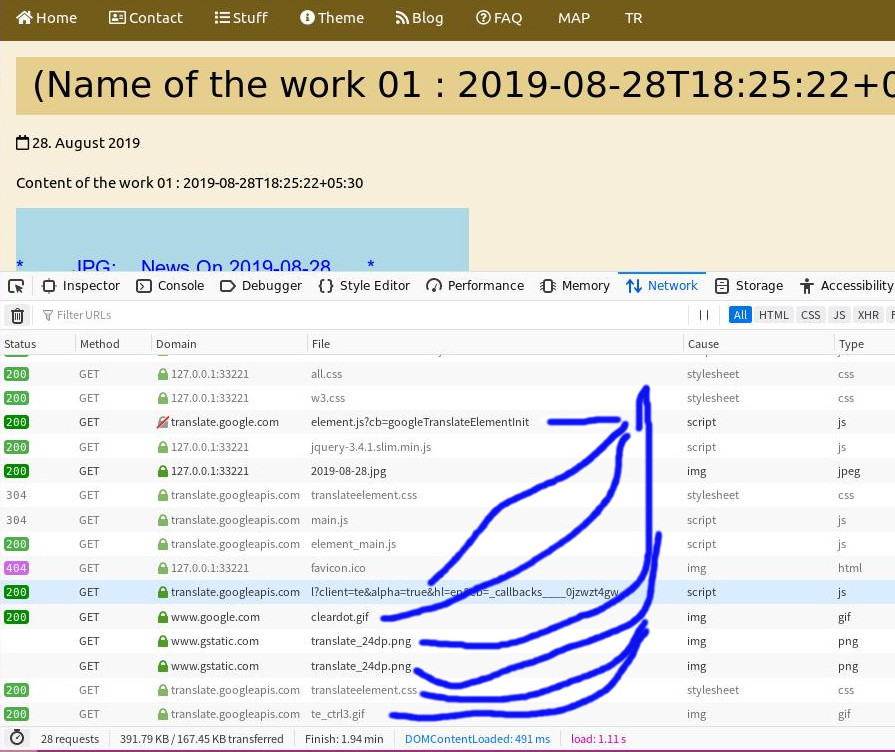

+++
title = "d20190829_1114am disqus leak bug found "
description = "d20190829_1114am disqus leak bug found "
weight = 20
+++

* 1、20190828 upload a new version dd5.chinadsf.org , and found the disqus leak. 技术人员未作泄漏检测，就自行更新了 dd5.chinadsf.org , 导致 disqus 插件泄漏出现

* 2、技术人员删除了 disqus 插件，并进行了泄露检测。检测中，发现 disqus 已经去除；但是，发现 google translation 插件仍然存在。理论上，google translation 插件也可以偷东西；这是否删除需要上层决定。

* 3、制定规则：每次发布之前，技术人员均进行网站泄漏测试，并截图，形成文档，放到 debug001.chinadsf.org 上，以作为上层批准的依据；上层批准后，技术人员才能正式更新网站。

* 4、制定规则：debug log 用于记录本网站所有发生过的问题； debug log 只允许用久经考验、没有可能发生泄露的的原始简单框架，不允许换框架，以避免这 debug log 本身造成泄漏。

* 5、以上，第3，第4，需要 Tang 批准一下。然后，在以后例行上传发布前，我都先给出检测报告；在 Tang / Jeffery 批准后才发布。

* 20190829 08:00am : fix, and delete all the disqus .  but , still found the google translation as the third-plugin.

